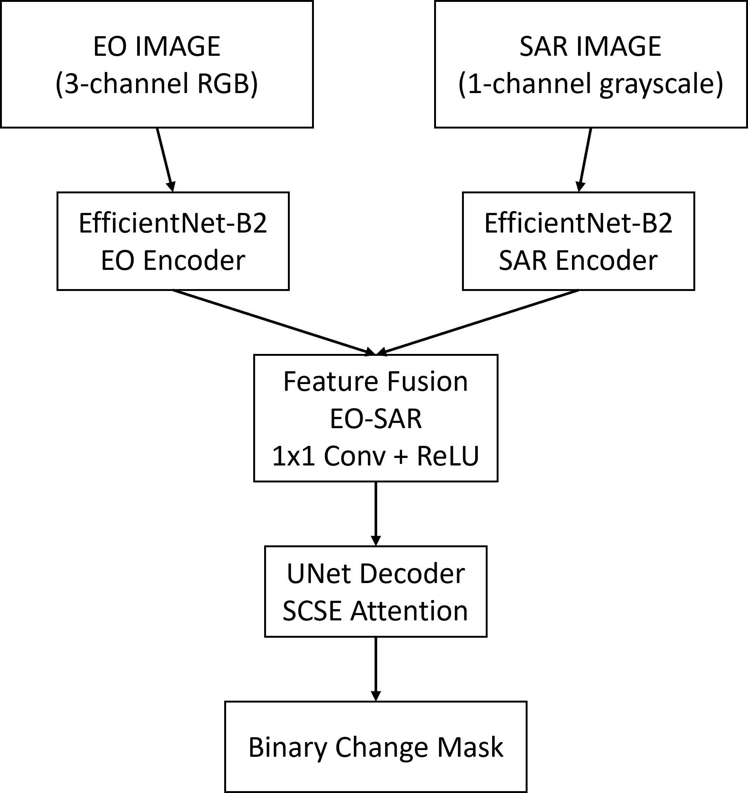
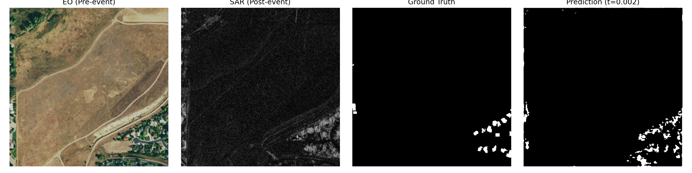

# EO-SAR Change Detection using Dual-Encoder Feature Fusion

A deep learning based EO-SAR change detection pipeline for binary segmentation of disaster-induced changes in satellite imagery. The project uses a dual-encoder fusion architecture with separate EO and SAR feature extraction, followed by feature-level fusion and U-Net decoding.

---

## Features

- Dual-encoder EO-SAR fusion architecture
- EfficientNet-B2 encoders
- U-Net decoder with SCSE attention
- Focal + Tversky hybrid loss
- Threshold sweep evaluation
- Visualization generation
- Black-corner noise handling
- EO-SAR modality-specific preprocessing

---

## Architecture

<p align="center">
  
</p>

The model uses separate EfficientNet-B2 encoders for EO and SAR modalities. Feature maps from both branches are fused using absolute feature difference and convolutional fusion before decoding through a U-Net style decoder with SCSE attention.

---

## Sample Prediction

<p align="center">
  
</p>

Example visualization showing:
- EO pre-event image
- SAR post-event image
- Ground truth mask
- Predicted change mask

---

## Repository Structure

```text
.
├── checkpoints/
├── data/
├── visualizations/
├── config.yaml
├── dataset.py
├── eval.py
├── losses.py
├── model.py
├── optuna_search.py
├── train.py
├── utils.py
├── requirements.txt
└── README.md
```

---

## Installation

Create environment and install dependencies:

```bash
pip install -r requirements.txt
```

---

## Dataset

The original dataset is not included in this repository due to size and usage restrictions.

Place the dataset inside:

```text
data/
```

Expected structure:

```text
data/
├── train/
│   ├── pre/
│   ├── post/
│   └── masks/
├── val/
│   ├── pre/
│   ├── post/
│   └── masks/
└── test/
    ├── pre/
    ├── post/
    └── masks/
```

Where:
- `pre/` → EO RGB images
- `post/` → SAR grayscale images
- `masks/` → binary segmentation masks

Image filenames must match across all folders.

---

## Training

Run training using:

```bash
python train.py
```

Training configuration can be modified inside:

```text
config.yaml
```

---

## Evaluation

Run evaluation using:

```bash
python eval.py
```

The evaluation script performs:
- threshold sweep
- metric computation
- confusion matrix generation
- visualization saving

---

## Model Weights

Pretrained model weights:

https://huggingface.co/cla5hr/eo-sar-change-detection/resolve/main/best_model.pth

Place downloaded weights inside:

```text
checkpoints/
```

---

## Final Test Performance

| Metric | Value |
|---|---|
| IoU | 0.0381 |
| F1-score | 0.0734 |
| Precision | 0.0437 |
| Recall | 0.2271 |

Threshold used during evaluation:

```text
0.003
```

---

## Key Observations

- The dataset is severely imbalanced (~1.57% positive pixels).
- EO and SAR modalities require separate preprocessing strategies.
- Transformer-based SegFormer experiments collapsed on this dataset.
- Dual-encoder fusion significantly improved validation performance compared to early fusion.
- Black satellite reprojection corners produced strong false positives during early experiments and were handled using low-amplitude noise injection.

---

## Hardware

- GPU: NVIDIA RTX 4050 Laptop GPU (6GB VRAM)
- RAM: 16GB
- Training resolution: 384×384
- Batch size: 4
